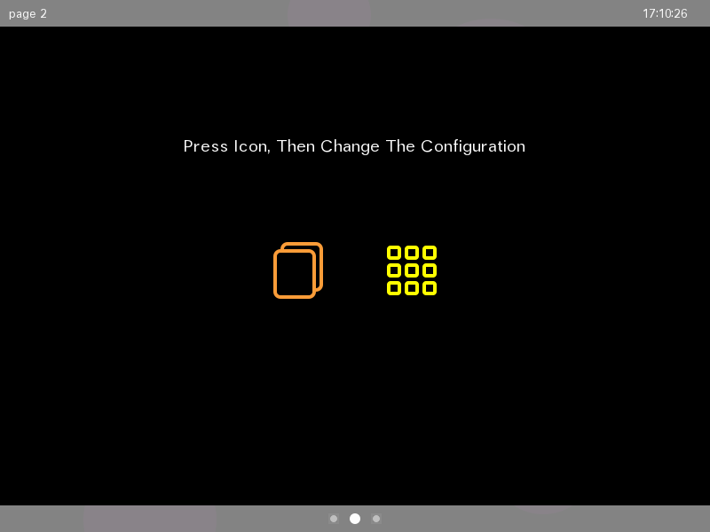
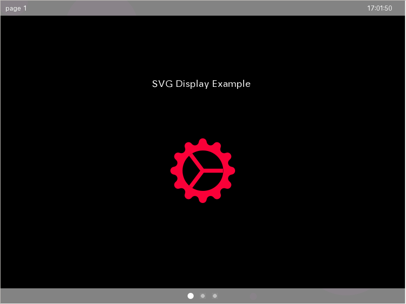
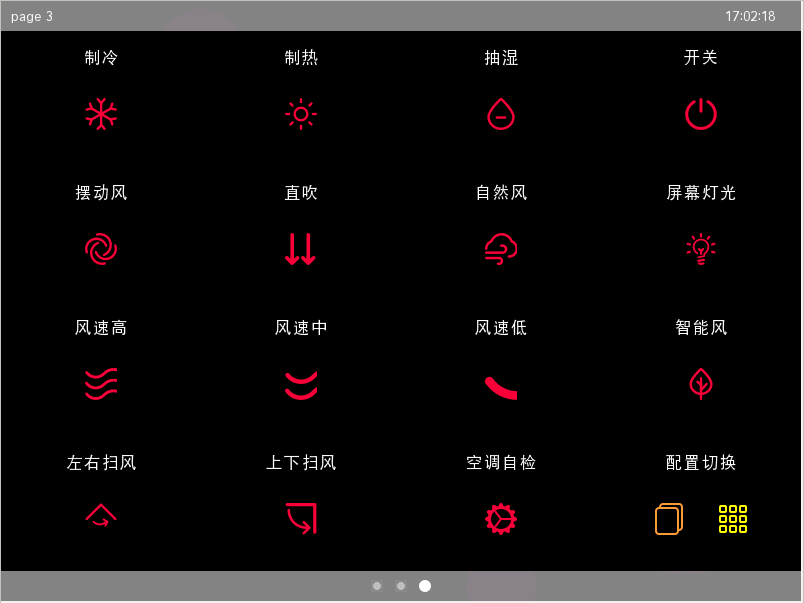
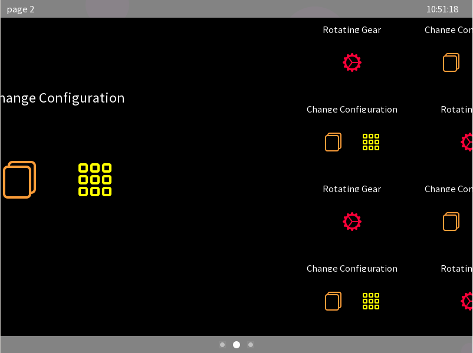

# Building Samples for HybridOS Lite

本文档假设用户使用的是 `Ubuntu Linux 18.04/20.04 LTS`。

为支持丰富的功能，`HybridOS` 具有庞大的软件栈。但是对于诸如 `IoT` 这样的嵌入式设备而言，由于硬件条件的限制，使其无法支撑 `HybridOS` 的资源开销。为了能在这些设备中使用 `HybridOS`，我们在 `HybridOS` 软件协议栈中，挑选了一些体积小、适用范围广的软件库，组成了 `HybridOS Lite`。`HybridOS Lite` 特别适用于成本敏感的嵌入式设备。通常情况下，这些设备最多只有 64M RAM，以及 64M 存储空间。

本文档将告诉读者，如何使用 `HybridOS Lite` 进行编程。

## HybridOS Lite 的技术特点  

- 体积小巧，更少的系统开销：

下面是对 `HybridOS Lite` 主要依赖库的统计（`arm v7` 版本）：

``` bash
libhibox.so          110576 
libhibus.so           43456 
libhicairo           787352 
libhidomlayout.so    847568
libhisvg.so          242360

libminigui_procs.so 3000688
liblibmgeff.so        31104
```

除去操作系统内核，以及必要的基础库，`HybridOS Lite` 主要依赖库仅占用 5M 左右的存储空间。如果考虑使用中文 `Truetype` 字体，则还需大概 `10M` 左右存储空间（视字体大小而定）。

- 功能解耦，多进程的编程模式：

`HybridOS Lite` 编程思路是：功能单一化、模块专业化、安全可靠化。将系统需求分离成若干个功能单一的独立模块，每个模块用一个单独进程实现。使得不同功能之间解耦，人机界面与数据逻辑的分隔。与传统嵌入式大进程、多线程的编程方式比，降低了系统的耦合度，减少了各个功能之间的干涉，增加了系统的稳定性。`HybridOS Lite` 可以监听到各个模块的工作状态，当某一模块发生异常时，`HybridOS Lite` 能够自动重启或者重新初始化该某块，使单一模块对系统的不良影响，降到最低；

- 数据驱动，连接云端的 `HiBus` 总线：

数据驱动，是 `HybridOS Lite` 的核心思想之一。功能解耦，界面与数据逻辑分离后，`Hibus` 总线将所有模块串联起来，使之成为一个有机的整体。与传统的消息驱动机制相比，`Hibus` 总线做了几点重要改进：使用 `Json` 格式的数据传递，增强数据传输的灵活性；提供不同进程之间的事件订阅与远程调用，`Hibus` 总线不但是数据传输的通道，还是逻辑功能的载体；提供跨平台的网络接口，打通不同设备之间、本机业务与云服务之间的壁垒，为嵌入式设备参与云服务提供了有效的技术支持；

- 布局文件，模块组合易如反掌：

在 `HybridOS Lite` 的编程思维中，功能解耦后形成若干功能模块，功能模块可以进行任意组合。功能模块如何组合，如何显示，则由布局文件 `manifest.json` 决定。在诸如工业控制面板、家用电器、智能门锁、智能音箱等产品中，多以屏为单位组织应用。因此 `HybridOS Lite` 使用了这样的应用组织方式。在布局文件中，指定了每屏所包含的应用、各个应用的位置、应用之间的通信关系等。同时提供了动态切换布局的机制，使得同一产品能轻易展示出不同的系统样貌；

- 跨界 `css`，应用界面随意调整：

传统编程方式中，界面元素的调整，无外乎两种方式：修改代码、重新编译；写一个私有的配置文件，指定界面元素的属性。但是这两种方式，在 `HybridOS Lite` 中得到了彻底改变。`HybridOS Lite` 借鉴了 `Web` 开发中的 `css` 规范，利用其指定界面元素的诸多属性。由于有 `CSS` 规范可循，任一了解 `CSS` 规范的开发者，都可以在不了解渲染逻辑的情况下，通过修改 `css` 属性对界面元素进行修改。有规可循，极大的提高了代码迭代速度，降低了代码维护难度，也极大的降低了对二次开发者的要求；

- 技术为王，`MiniGUI` 与时俱进：

`MiniGUI` 做为国内最成功的多窗口图形系统，此次推出 `HybridOS Lite`，不但继承了多窗口管理系统，并在绘制中，引入了 `cairo` 矢量图形库接口。使用 `cairo`，可以轻松进行缩放、旋转、变换，极大降低了开发难度；使用矢量图形，不但减少了图形的存储空间，而且在缩放中消除了锯齿。做为开发者，不但可以使用 `MiniGUI API` 编程，同时也可使用 `Cairo API` 进行编程。流行新技术的引入，丰富了开发者的编程手段，增强了人机的界面的流畅度、友好性，极大的提高了用户体验。


## 本代码的目录结构  

```
hybridos-lite/
├── build-lib
│   ├── fetch-all.sh
│   └── build-all.sh
├── src
│   ├── mginit
│   ├── wallpaper
│   ├── chgconfig
│   ├── svgshow 
│   ├── include 
│   ├── layout
│   │     ├── manifest.json
│   │     ├── newconfig.json
│   │     ├── default_layout.css
│   │     ├── svgshow1.css
│   │     ├── svgshow2.css
│   │     ├── chgconfig1.css
│   │     └── chgconfig2.css
│   └── config
│         ├── svgshow1.ini
│         ├── svgshow2.ini
│         ├── chgconfig1.ini
│         └── chgconfig2.ini
└── cmake 
```

如上图所示，显示了仓库中的主要目录，它们的是：

- `cmake/` ：包含 `Find<Package>.cmake` 文件，用于检查软件包的依赖性及获得编译参数；
- `build-lib/`：包含了编译依赖库的脚本文件；
  - `fetch-all.sh`：获得依赖库脚本；
  - `build-all.sh`：编译依赖库脚本；
- `src/`：包含应用程序和配置文件；
  - `mginit/`：`mginit` 程序。展示了如何解析 `manifest.json` 文件，如何布局以及如何使用合成器，是 `HybridOS Lite` 的关键组件；
  - `wallpaper/`：动态壁纸应用；
  - `chgconfig/`：动态切换配置文件应用程序；
  - `svgshow/`：展示如何使用 `svg` 图片应用程序；
  - `config`：包含了用户自定义的与业务相关的数据文件；
  - `layout/`：包含了布局文件；
    - `manifest.json`：最重要的布局文件，其定义了每屏显示哪些应用程序，以及这些应用程序的布局；
    - `newconfig.json`：另外一个布局文件，用于展示如何动态切换布局；
    - `default_layout.css`：默认的 `css` 文件。其为每个重要的 `dom` 元素设置了默认的布局样式；
    - `svgshowx.css`：`svgshow` 应用的 `css` 文件。同一个应用显示在屏幕不同位置，大小不同时，需要不同的布局文件来指定各个元素的位置与大小；
    - `chgconfigx.css`：`chgconfig` 应用的 `css` 文件。

## 编译步骤  

### 前置条件

在 `Ubuntu Linux` 中，用户使用 `apt install <package_name>` 命令，用以安装下面的软件包。

* 编译工具：
   * git
   * gcc/g++
   * binutils
   * autoconf/automake
   * libtool
   * make
   * cmake
   * pkg-config
   * gtk-doc-tools
* 依赖库：
   * libgtk2.0-dev
   * libjpeg-dev
   * libpng-dev (libpng12-dev on Ubuntu Linux 16.04 instead)
   * libfreetype6-dev
   * libinput-dev
   * libdrm-dev
   * libsqlite3-dev
   * libxml2-dev
   * libssl1.0-dev

在 `Ubuntu 18.04/20.04` 下，可使用下面的命令，编译并安装 'HybridOS Lite`：

1. 获得源代码

```
$ cd hybridos-lite/build-lib
$ ./fetch-all.sh
```

1. 编译 `HybridOS Lite` 依赖库

```
$ ./build-all.sh
$ cd ..
```

1. 编译 `HybridOS Lite`

```
$ mkdir build
$ cd build
$ cmake ../
$ make
```

## 运行 HybridOS Lite  

运行 `HybridOS Lite`，需要两个终端。一个用来执行 `hibusd`，一个用来执行 `mginit`。

打开一个终端，执行下面的命令：

```
$ cd hybridos-lite/build-lib/hibus/src 
$ sudo hibusd -d
```

在另外一个终端，执行下面的命令：
```
$ cd hybridos-lite/bin 
$ ./mginit
```

在屏幕上，将出现如下的窗口

- `chgconfig` 应用。当点击应用中的图标后，`HybridOS Lite` 将动态切换布局文件。当动态切换布局文件时，可注意屏幕下方的 `indicator bar` 的变化。


- `svgshow` 应用。 


- 当动态切换布局文件时，有一屏将同时显示16个应用。如下图：


- 用鼠标在屏幕上拖动，或者点击屏幕下方的 `indicator bar` 时，屏幕将在不同层间切换。

