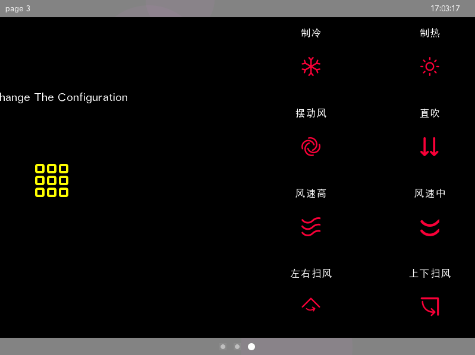

# HybridOS Lite 编程指南 

【主题】HybridOS Lite 编程指南 
【摘要】本文描述了 `HybridOS Lite` 的基本概念，并讲述了编程的基本方法和思路
【版本】1.0
【作者】耿岳
【日期】2021 年 05 月
【状态】初稿

**版权声明**

版权所有 &copy; 2020 北京飞漫软件技术有限公司
保留所有权利

此文档不受合璧操作系统相关软件开源许可证的管辖。

飞漫软件公开此文档的目标，用于向开发者解释 `HybridOS Lite` 的基本概念和编程方法。在未获得飞漫软件书面许可之前，任何人不得复制或者分发本文档的全部或部分内容，或利用本文档描绘的技术思路申请专利、撰写学术论文等。

本文涉及到的飞漫软件或其合作伙伴的注册商标或商标，有关其详细列表，请查阅文档末尾。

**目录**

- [HybridOS Lite 的结构](#hybridos-lite-的结构)
- [HybridOS Lite 基本概念](#hybridos-lite-基本概念)
   + [屏幕的组成](#屏幕的组成)
   + [页的构成与组织](#页的构成与组织)
   + [MiniGUI 的层（Layer）](#minigui-的层（layyer）)
   + [MiniGUI 的合成器（Compositor）](#minigui-的合成器（compositor）)
   + [HybridOS Lite 的编程思路与步骤](#hybridos-lite-的编程思路与步骤)
- [配置文件](#配置文件)
   + [manifest.json 文件](#manifest.json-文件)
   + [用户 CSS 文件](#用户-css-文件)
   + [其他配置文件](#其他配置文件)
- [HybridOS Lite 应用开发](#hybridos-lite-应用开发)
   + [应用程序的启动参数](#应用程序的启动参数)
   + [应用程序的布局](#应用程序的布局)
   + [应用程序中的鼠标拖拽](#应用程序中的鼠标拖拽)
- [附：商标声明](#附商标声明)


`HybridOS` 具有完备的软件栈，相应也占用了大量的系统资源，所以不适用于系统资源紧张的嵌入式小设备。

在对软件栈进行分析后，挑选出一些通用、小巧的软件包，组成了 `HybridOS Lite`。下面就如何编写 `HybridOS Lite` 应用，进行论述。

## HybridOS Lite 的结构  

下图给出了 `HybridOS Lite` 的应用支持架构：

```
 ---------------------------------------------------------------------------------
| DockerBar, StatusBar, |              |                 | Input Method Window,  |
| IndicatorBar,         |   GUI app1   |   GUI app ...   | System Alert Window,  |        - main windows
| DescriptionBar ...    |              |                 | ...                   |
 ---------------------------------------------------------------------------------
|                   Wallpaper                 |      mginit w/ compositor         |____ 
 ---------------------------------------------------------------------------------     |
|                                                                                 |    |
|   MiniGUI, hiCairo, hirsvg, hibox, hibus, hidomlayout, LibPNG, LibJPEG, ...     |    | hiBus
|                                                                                 |    |
 ---------------------------------------------------------------------------------     |
|                           HybridOS servers and user daemons                     |____|
 ---------------------------------------------------------------------------------
|                             LibZ, CURL, LibGcrypt, ...                          |
|                               C/C++ runtime environment                         |
 ---------------------------------------------------------------------------------
|                               Linux Kernel/Drivers                              |
 ---------------------------------------------------------------------------------
```

由上图可知，`HybridOS Lite` 有以下技术特点：

- 用户操作与业务逻辑的分离：`GUI` 程序负责用户交互，业务数据的逻辑处理，由守护进程完成；
- 多进程：根据需求，将整个系统切分成若干个模块。每个模块均为一个可独立运行的应用程序。多进程的结构，保证了系统的可靠性；
- `HiBus` 总线：`HybridOS Lite` 是数据驱动的，所有数据通过 `HiBus` 总线进行传输。`HiBus` 总线数据使用 `json` 格式，具有跨平台性；
- `CSS` 调整布局：将 `GUI` 布局从可执行代码中分离出来，使用 `CSS` 进行布局 。这样同一个应用的不同实例，皆可通过调整 `CSS` 文件的方式，在不修改二进制代码的前提下得以实现。


## HybridOS Lite 基本概念

### 屏幕的组成

屏幕分成四个区域，如下图：

```
┌────────────────────────────────────────┬────────────────────────────────────┐
│                Title Bar               │            Description Bar         │
├────────────────────────────────────────┴────────────────────────────────────┤
│                                                                             │
│                                                                             │
│                                                                             │
│                                    Page Area                                │
│                                                                             │
│                                                                             │
│                                                                             │
├─────────────────────────────────────────────────────────────────────────────┤
│                                 Indicator Bar                               │
└─────────────────────────────────────────────────────────────────────────────┘
```

- `Title Bar`：显示每页的标题；
- `Description Bar`：显示每页的描述，以及时间；
- `Page Area`：显示不同的页。每页由一个或者多个应用程序组成；
- `Indicator Bar`：显示页选择器，当操作页选择器时，`Page Area` 显示选中的页。

以上是一种典型的屏幕布局方式。可以通过修改 `manifest.json` 文件进行改变。比如去掉用不到的 `Bar`，或者改变各个区域的位置。屏幕的四个区域，唯一必须存在是 `Page Area`，也即是应用的展示区域。

屏幕的布局是由 `manifest.json` 文件决定的，且是全局性的。也即布局一次，不管 `Page Area` 中的内容如何改变，四个区域的位置不再改变。

### 页的构成与组织  

`HybridOS Lite` 所有 `GUI` 应用，都展示在 `Page Area` 中。在一屏显示中，`Page Area` 中的内容，称为一页。根据用户需求，可以存在多个页，使得每个页展示有限的应用。应用在页中的位置，由 `manifest.json` 文件指定。

下图是在 `HybridOS Lite` 中，两个典型的页布局。

Page 1:

```
┌────────────────────────────────────────┬────────────────────────────────────┐
│                                        │                                    │
│                                        │                                    │
│                                        │                                    │
│             application 1              │            application 2           │
│                                        │                                    │
│                                        │                                    │
│                                        │                                    │
└────────────────────────────────────────┴────────────────────────────────────┘
```

Page 2:

```
┌────────────────────────────────────────┬────────────────────────────────────┐
│                                        │                                    │
│             application 1              │            application 2           │
│                                        │                                    │
├────────────────────────────────────────┼────────────────────────────────────┤
│                                        │                                    │
│             application 3              │            application 4           │
│                                        │                                    │
└────────────────────────────────────────┴────────────────────────────────────┘
```

通过点击 `Indicator Bar` 中的页选择器，或者用鼠标在 `Page Area` 中的拖拽，可在各个页之间进行切换。实际效果如下图。

页1，只包含一个 `GUI` 应用:


页2，包含了16个 `GUI` 应用:


鼠标拖拽，进行页切换



### MiniGUI 的层（Layer）

层（`Layer`）是 `MiniGUI` 中的概念。一个应用程序首先要调用 `JoinLayer()` 函数，就是将应用程序的显示加入到某一个层中，如该层不存在，则 `mginit` 将负责为其创建一个层。

在每一层中，有自己独立的 `z序` 和 `z节点`。当需要显示某层时，调用 `SetTopmostLayer()` 函数，将该层调整为最上层，在屏幕中显示；并将键盘、鼠标消息发送至该层。与此同时，其他层中的应用程序，依然在后台正常运行。

`MiniGUI` 中层的概念与实现，与 `HybridOS Lite` 中的 `Page` 需求完全吻合：

- 每一页对应了一个层；

- 每个层可以包含一个或多个应用程序，同时显示；

- 仅显示最上面的层（Topmost Layer)，其他层不显示。但是其他层的应用程序依然在运行；

- 键盘、鼠标消息，mginit 只发送给 Topmost Layer；

- mginit 负责进行层的切换以及切换效果。

当前 `MiniGUI 5.0` 中，支持的最大层数为16。也就是说，可以最多有16页。

  
### MiniGUI 的合成器（Compositor）

如前所述，层之间的切换是通过合成器（`Compositor`）完成的，合成器是 `MiniGUI` 中重要的组成部件。层的显示，每个主窗口的位置，都是由合成器最终确定。`MiniGUI` 为用户提供了合成器的开发接口，用户可以根据需求，开发自己的合成器，从而获得更加完美的用户体验。

做为示例，在本代码中，合成器只完成了页切换时的缩放效果（点击页选择器），页切换时的动画效果（拖拽鼠标）。

缩放效果如下：


### HybridOS Lite 的编程思路与步骤

综上所述，可以总结出 `HybridOS Lite` 下的编程思路与步骤，如下：

- 分析需求，将系统整体功能拆分成若干个单独的模块，完成系统级的功能解耦；

- 分析每个模块，将用户交互操作，与业务逻辑分离，完成 `GUI` 与数据的解耦；

- 确定每个模块的 `GUI` 部分与数据部分的 `HiBus` 通信协议，包括 `HiBus` 的事件与远程调用；

- 确定各个模块间的 `HiBus` 通信协议，包括 `HiBus` 的事件与远程调用；

- 编写作用全局的 `manifest.json` 文件。明确屏幕布局，每页中应用程序的布局，明确各个模块之间通信的目的应用；

- 为每个模块的 `GUI` 部分编写布局用的 `CSS` 文件，及相关的用户数据文件。相同布局的模块可使用同一个 `CSS` 文件；

- 编写每个模块的 `GUI` 应用。`HybridOS Lite` 在应用层面的编码，与普通 `MiniGUI` 程序没有任何差别，只是多出了根据 `CSS` 文件的布局部分；

- 编写业务处理的守护进程。守护进程与各个其他部分之间，按照前面制定的 `HiBus` 协议进行通信；

- 如有需要，修改 `mginit` 中的合成器，达到页间切换的动态效果；

## 配置文件  

在 `HybridOS Lite` 中，牵涉的配置文件主要有三个，每个文件与各个应用之间的关系如下：

- manifest.json   ───→  mginit：用户全局的屏幕布局，以及以应用程序为单位的页布局；

- 用户 `CSS` 文件 ───→  用户程序：用于该程序各个 `GUI` 元素（Element）的布局；

- 用户配置文件    ───→  用户程序：用于该程序的初始化及数据记录，与早期的 `ini` 文件功能相同；

- `HiBus` 协议    ───→  包含 `mginit` 的全部程序（包含守护进程）。

### manifest.json 文件

`manifest.json` 文件的规范，在《合璧操作系统的应用管理》中已经详细说明。下面只是以本代码中使用的 `manifest.json` 文件，举例说明。

```
{
    "defaultCSSFile":"default.css",
    "direction": "horizental",
    "tileBoxStyle": "display: inline-block; position: relative; left: 0%; top: 0%; width: 50%; height: 5%;",
    "descriptionBoxStyle": "display: inline-block; position: relative; left: 0%; top: 0%; width: 50%; height: 5%;",
    "pageBoxStyle": "display: inline-block; position: relative; left: 0%; top: 0%; width: 100%; height: 90%;",
    "indicatorBoxStyle": "display: inline-block; position: relative; left: 0%; top: 0%; width: 100%; height: 5%;",
    "page": [
        {
            "id": "1",
            "title": {
                "en": "page 1",
                "zh_CN": "change configuration 1"
            },
            "windowLayoutStyles": null,
            "runners": [
                {
                    "name": "chgconfig",
                    "type": "exec",
                    "entry": "chgconfig -d chgconfig1.ini -c chgconfig1.css",
                    "runas": "window, default",
                    "class": "",
                    "dependencies": ["hibusd"],
                    "windowBoxStyles": "position: relative; left: 0%; top: 0%; width: 100%; height: 100%;"
                }]
        },
        {
            "id": "2",
            "title": {
                "en": "page 2",
                "zh_CN": "gear running"
            },
            "windowLayoutStyles": null,
            "runners": [
                {
                    "name": "gear",
                    "type": "exec",
                    "entry": "gear -d gear1.ini -c gear1.css",
                    "runas": "window, default",
                    "class": "",
                    "dependencies": ["hibusd"],
                    "windowBoxStyles": "position: relative; left: 0%; top: 0%; width: 100%; height: 100%;"
                }]
        }
  ]
}
```

- `defaultCSSFile`：`HybridOS Lite` 中有系统默认的 `CSS` 样式，用户可以根据自己的需求，编写一个自己的 `CSS` 文件，对默认样式进行覆盖；

- `direction`：表明屏幕的方向，是横屏还是竖屏。这里表示屏幕是横屏；

- `tileBoxStyle`：`Title Bar` 的样式，这里表明其在屏幕左上方，宽度为屏幕 50% ，高度为屏幕 5%；

- `descriptionBoxStyle`：`Description Bar` 的样式，这里表明其在屏幕上方，仅跟 `Title Bar`，宽度为屏幕 50% ，高度为屏幕 5%；

- `pageBoxStyle`：`Page Area` 的样式，这里表明其在 `Title Bar` 下方，宽度为屏幕 100% ，高度为屏幕 90%；

- `indicatorBoxStyle`：`Indicator Bar` 的样式，这里表明其在 `Page Area` 下方，宽度为屏幕 100% ，高度为屏幕 5%；

- `page`：为一个 `json` 数组，每一个元素描述一页。这里表明一共有两页；

- `name`：在一个 `manifest.json` 文件中，每一个应用实例（不是每一个应用），都有自己唯一的名字。`HiBus` 利用这个名字，区分不同应用的实例，表示源地址和目的地址；

- `entry`：可执行程序的程序名，以及启动参数。启动参数由每个应用程序自行解析并实现。这里只是表明：应用程序名为 `chgconfig`，用户配置文件名为 `chgconfig1.init`，应用布局 `CSS` 文件名为 `chgconfig1.css`；

- `windowBoxStyles`：指定了该应用在 `Page Area` 中的位置。在这里，`chgconfig` 和 `gear` 占用了全部的 `Page Area`，也即全屏显示。

其余内容，《合璧操作系统的应用管理》已经表述清除，不再赘述。

在目前的 `HybridOS Lite` 版本中，`CSS` 只支持两级布局。也即屏幕为第一级，页为第二级。

### 用户 CSS 文件

在应用程序中，`GUI` 是由一个个元素（Element）构成的。元素可以是一段文字、一个图标，或者一个控件。下面以 `chgconfig1.css` 为例进行说明。

`chgconfig` 的应用布局如下图：

```
┌─────────────────────────────────────────────────────────────────────────────┐
│    ┌──────────────────────────────────────────────────────────────────┐     │
│    │                      Application Description                     │     │
│    └──────────────────────────────────────────────────────────────────┘     │
│                                                                             │
│                ┌──────────────────┐      ┌───────────────────┐              │
│                │                  │      │                   │              │
│                │      Icon 1      │      │      Icon 2       │              │
│                │                  │      │                   │              │
│                └──────────────────┘      └───────────────────┘              │
│  Main Window                                                                │ 
└─────────────────────────────────────────────────────────────────────────────┘
```

`Main Window` 的位置和大小，是 `mginit` 通过 `manifest.json` 文件确定的。用户的 `CSS` 文件只确定主窗口里各个元素的位置关系。 

其用户 `CSS` 文件为：

```
#caption
{
    display:block; 
    position: relative; 
    left: 20%; 
    top: 20%; 
    width: 60%; 
    height: 10%; 
    font-size:30px;
}

#icon0
{
    display:inline-block; 
    position: relative; 
    left: 38%; 
    top: 35%; 
    width: 8%; 
    height: 8%;
}

#icon1
{
    display:inline-block; 
    position: relative; 
    left: 46%; 
    top: 35%; 
    width: 8%; 
    height: 8%;
}
```

由上面的 `CSS` 文件可知：

- `id` 为 `caption` 的元素，左起窗口宽度的 20%，上起窗口高度的 20%，宽度为窗口宽度的 60%，高度为窗口高度的 10%，字体大小为 30 个像素点；

- `id` 为 `icon1` 的元素，宽度为窗口宽度的 8%，高度为窗口高度的 8%，左移窗口宽度的 38%，下移窗口高度的 35%；

- `id` 为 `icon2` 的元素，宽度为窗口宽度的 8%，高度为窗口高度的 8%，左移窗口宽度的 46%，下移窗口高度的 35%。

在这里，`CSS` 的选择器使用的是 `id`，也可以使用 `class`、`name`。`CSS` 文件的语法，完全符合 `CSS2.1` 规范。

同一个应用的多个实例，可能被放置在不同页中，其大小很可能也各不相同。比如 `gear` 应用可以独占 `Page Area`，也可能只占用 `Page Area` 的1 /16，此时如果依然适用该 `CSS` 文件，则比例不协调，并且文字无法显示。需要为这个应用实例单独再写一个 `CSS` 文件。

这样各个应用的不同实例可以随意摆放，不用调整二进制代码，只需要修改对应的 `CSS` 文件即可。这样即打破了硬件设备对 `GUI` 的约束，达到快速开发，迅速出产品的目的。

在目前的 `HybridOS Lite` 版本中，`CSS` 只支持两级布局。

### 其他配置文件

其他与业务相关的配置文件，根据需求用户自行确定，`HybridOS Lite` 不做任何限定。

`HiBus` 协议为用户私有协议，只要符合《合璧操作系统设备端数据总线概要设计》即可。

## HybridOS Lite 应用开发 

由于对 `manifest.json` 文件的处理，全局的布局，应用程序的启动，都由 `mginit` 负责了。因此对于普通用户而言，只需要直接开发自己的应用程序即可。

`HybridOS Lite` 应用程序的开发，与普通 `MiniGUI` 程序开发，没有任何本质的不同。只是多了两个步骤，在这里进行说明。

### 应用程序的启动参数

`mginit` 向 `HybridOS Lite` 应用，传递的启动参数可能有：

- `-l layer_number`：该参数为一数字，必传，必须处理。每个应用都属于某层，所以必须调用 `JoinLayer()` 将该应用加入到某层。层的名字为 `layern`，`n` 为传递进来的参数；

- `-n name`：该参数为一字符串，必传，必须处理。该参数用于 `HiBus` 唯一标识某个应用的实例；

- `-d config_file_name`：该参数为一字符串，可选。该参数即是在 `manifest.json` 文件中 `entry` 中的 `-d` 部分，表明该应用使用的用户数据文件；

- `-c css_file_name`：该参数为一字符串，可选。该参数即是在 `manifest.json` 文件中 `entry` 中的 `-c` 部分，表明该应用使用的 `CSS` 文件；

- 其他参数：用户在 `manifest.json` 文件中 `entry` 中定义的其他参数，由应用程序自行解析处理。

### 应用程序的布局

在 `HybridOS Lite` 中，所有布局功能，都使用 `hidomlayout` 库完成。完成布局代码可以参考 `src/chgconfig/main.c` 中的 `parse_config()` 函数。基本布局步骤如下：

- 调用 `hilayout_css_create()` 创建一个 `HLCSS` 对象；

- 调用 `hilayout_element_node_create()` 创建 `dom` 树根节点；

- 调用 `hilayout_element_node_create()` 创建各个元素节点；

- 调用 `hilayout_element_node_set_xxx()` 设置各个元素的 `id`、`class`、`name`，与用户 `CSS` 文件对应；

- 调用 `hilayout_element_node_append_as_last_child()` 为各个元素设置父子关系；

- 调用 `hilayout_do_layout()` 开始布局计算；

- 为各个元素调用 `hilayout_element_node_get_used_box_value()` 获得各个元素的位置；

- 如果元素用于显示文字，则调用 `hilayout_element_node_get_used_text_value()` 获得该元素显示文字的字体信息。

### 应用程序中的鼠标拖拽

`mginit` 的合成器，首先截获鼠标消息，然后判断鼠标是否滑动。如果不是滑动，则由 `Desktop` 将鼠标消息发送给对应的应用程序。如果应用程序也需要处理鼠标的拖拽（比如滚轮），则需要通知 `mginit` 不要处理任何鼠标消息，将鼠标消息直接发送给自己。

在应用程序需要自行处理鼠标拖拽消息的时候，调用 `MiniGUI API`：

`SetMainWindowGestureFlags(HWND hWnd, DWORD dwFlags);`

当结束自行处理鼠标拖拽时，调用：

`SetMainWindowGestureFlags(HWND hWnd, 0);`

应用程序默认不自行处理鼠标拖拽。


## 附：商标声明

本文提到的产品、技术或者术语名称，涉及北京飞漫软件技术有限公司在中国或其他地区注册的如下商标：

1) 飛漫


2) FMSoft


3) 合璧


4) HybridOS


5) HybridRun


6) MiniGUI


6) xGUI


7) miniStudio


